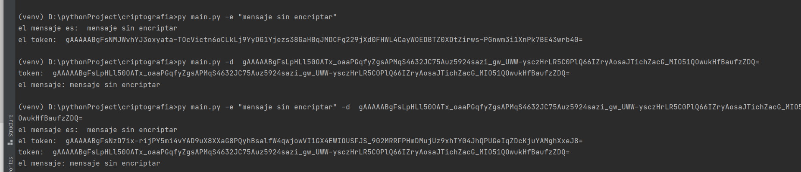
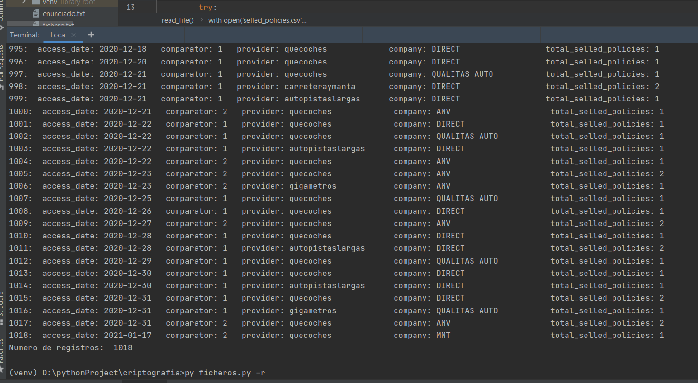
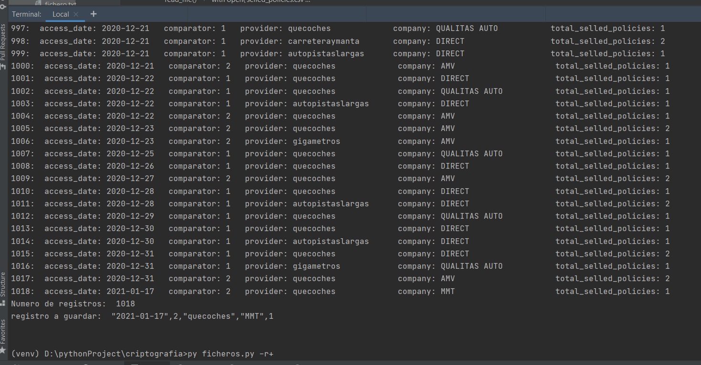
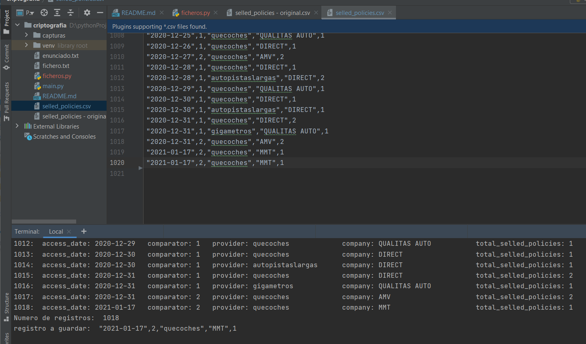

# Criptografía

## Práctica 5 - Criptografía y Consulta y acceso a ficheros

Para la presente práctica vamos a trabajar con la librería cryptography de Python para
enviar y recibir mensajes encriptados y la librería os para acceso a ficheros y posterior
manejo sobre ellos.

### Ejercicio 1 - Criptografía

Dada la librería cryptography, realizad la instalación en vuestro entorno de trabajo para
poder hacer uso de ella.

Una vez instalada construir un programa que según un parámetro de entrada -e (encode) o
-d (decode) reciba una cadena de caracteres en texto plano y la encripte o bien la
desencripte según el parámetro.

Para ello nuestro programa, en primer lugar, deberá generar una clave para codificar y
decodificar (esta debe ser la misma).

El programa tras generar la clave, debe ser capaz de almacenarla en un fichero para poder
consultar la clave para poder decodificar un texto si se lo pasamos codificado o para
codificar un texto si se lo pasamos en formato plano.

El programa deberá comprobar que existe un fichero con clave para no generar otra. Si esta
comprobación no existe, se podría dar el caso de que cree una clave para codificar y
después no podamos decodificar un mensaje o a la inversa.

### Ejercicio 2 - Consulta y acceso a ficheros

Dado el fichero adjunto en la práctica (selled_policies.csv), se pide crear un programa capaz de leer y escribir
sobre el mismo fichero.

Según el modo de apertura que le pasemos como parámetro al programa este realizará
unas acciones:

- Modo lectura (r): Se pide leer la primera fila del fichero y mostrar el resto de filas con
las cabeceras de cada campo y su valor.
  - Captura del resultado en pdf.
- Modo lectura y escritura (r+): Se pide leer la primera fila del fichero y mostrar el resto
de filas con las cabeceras de cada campo y su valor. Una vez lleguemos al final,
duplicar la línea final sobre el mismo fichero.
  - Captura del resultado en pdf y adjuntar el nuevo fichero escrito.

○ ¡NOTA!: se puede hacer uso de otros modos de apertura para escribir la
última línea duplicada. Por ejemplo, al recorrer el fichero guardar la última
línea en una variable y abrir de nuevo el fichero en modo Añadido (este
dispone el puntero al final del fichero para seguir escribiendo) y de esta forma
duplicar esa última línea con lo guardado en la variable.

- Abrir el fichero en solo escritura (w): ¿Qué ocurre al abrir un fichero en modo solo
escritura con el mismo nombre que el fichero que tenemos?

## Resultado

<https://github.com/jrodriguezballester/Criptografia.git>

### Solución Ejercicio 1 - Criptografía main.py

El mensaje a encriptar, si tiene espacios en blanco debe escribirse entre comillas "

Instrucciones esenciales para cumplir los requisitos del enunciado

- Creation de los parámetros de entrada
  - parser.add_argument('-d', '--desencrip', help='Mensaje a decodificar')
  - parser.add_argument('-e', '--encrip', help='codificar mensaje')
- Generar clave
  - Fernet.generate_key()
- Almacenar clave
  - La clave se almacena en fichero.txt
  - file.write(key)
- Comprobar si existe el fichero con la clave
  - os.path.isfile('fichero.txt')
- Encriptar mensaje
  - f.encrypt(mensaje.encode())
- Desencriptar mensaje
  - f.decrypt(token).decode()

#### Captura de pantalla

Ejecución del programa con sus parámetros por separado y a la vez

### Solución Ejercicio 2 - Consulta y acceso a ficheros ficheros.py

El programa se ejecuta con tres argumentos excluyentes (solo uno cada vez)

- r Modo lectura: Abre el fichero en modo lectura, y ejecuta una función que recoge los nombre de los campos de la primera fila del fichero;
  imprime cada registro con el número de registro, nombre del campo y su valor
- r+ Modo escritura: Abre el fichero en modo escritura, ejecuta la misma función anterior y guarda en el fichero el último registro.
- w Modo sobre escritura: Abre el fichero en modo sobre escritura. (Importante borra los datos; hay una copia original del fichero para recuperarlos)

#### ¿Qué ocurre al abrir un fichero en modo solo escritura con el mismo nombre que el fichero que tenemos?

Depende de:

- Apertura y cierre: El fichero si tiene algún registro lo pierde
- Lectura: Ocurre una excepción io.UnsupportedOperation: not readable
- Escritura: El fichero se queda solamente con los datos que mandamos guardar; si el fichero tiene otros datos anteriores se perderán.
- Si el fichero no existe: lo crea

#### Capturas de pantalla

py ficheros.py -r

py ficheros.py -r+

Fichero selled_policies.csv modificado

(El desfase entre el número de registro y el número de línea se debe a la línea de cabecera con los campos)
